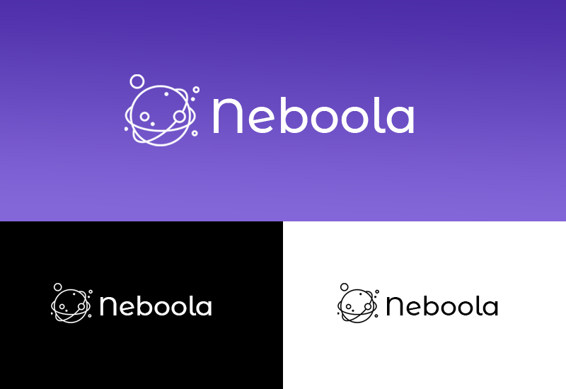

# PROYECTO AIEP / SMU "Neboola"

Neboola es una página web que permitirá a los usuarios obtener material informativo por medio de texto, imágenes y videos extraídos directamente desde la API de libre uso de la NASA.

### Zona pública

+ **Página e inicio:** En esta sección encontraremos información sobre la idea general de la página y parte de la galeria a la cual los usuarios podrán acceder. La barra de navegación podrá direccionar al usuario al formulario de inscripción o al login para iniciar sesión al panel de usuario. 
+ **Formulario:** El usuario podrá registrar su información para acceder a la zona privada de la página web.
+ **Paquetes:** Se podrán visualizar las opciones de paquetes de suscripción para que el usuario acceda al material.

### Zona privada

+ **Sistema de autenticación y panel de control:** Al ingresar correctamente la información de inscripción, se accederá al panel de usuario, en dónde se podrá observar el material guardado con anterioridad y la gestión general de la cuenta.
+ **Galeria:** Este apartado le permitirá al usuario acceder a la galeria de fotos, información y videos de múltiples elementos astronómicos. Se integrá una barra de búsqueda para encontrar los elementos de forma más específica.W

## Guía de estilos

### Logo

### Figma
[Prototipo Página web Neboola](https://www.figma.com/file/LvQ3hvBZmC6cE0TtWRHgBI/Neboola?node-id=0%3A1&t=8IZBchXBZaSLGhX1-1/ "Figma 'Neboola'")

### Tipografías
+ Logo: Montserrat Alternates
+ Títulos y párrafos: Maven Pro Regular, Medium y Bold.

### Paleta de colores
| Color             | Hex                                                                |
| ----------------- | ------------------------------------------------------------------ |
| Example Color |  #27035E |
| Example Color |  #4B2CA7|
| Example Color |  #8366D8 |
| Example Color |  #f5f1fa |

### Equipo de trabajo:
+ [Francisca Madariaga](https://github.com/framciscat) Product Owner & Developer
+ [Frederick Cid](https://github.com/Rodkaaaa) Developer
+ [Ariel Sepúlveda](https://github.com/a-sepulveda-r) Developer

### Deploy
[Neboola Github Pages](https://framciscat.github.io/proyecto-aiep/ "Neboola Github Pages")